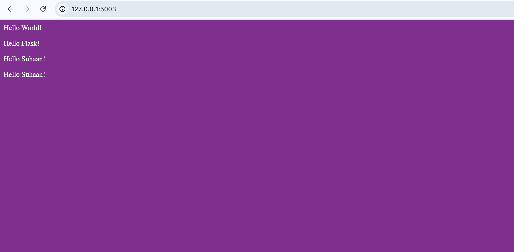
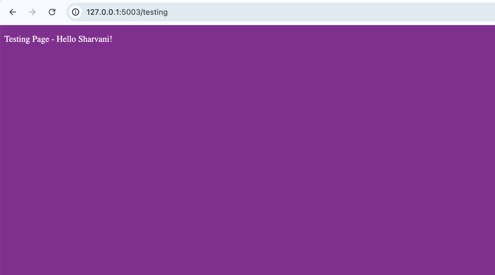
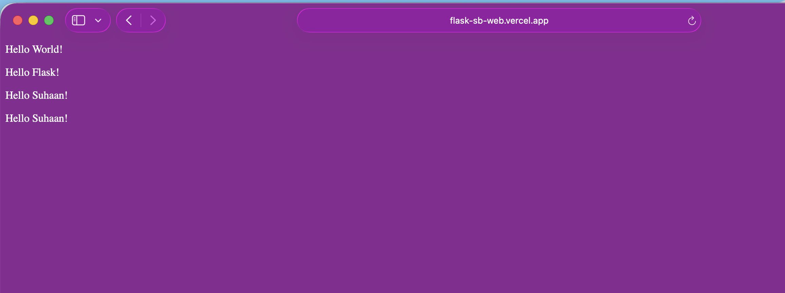

# Flask-SB-Web
Simple Web Interface Made using Flask, guided Horizons Project

Vercel Host URL: https://flask-sb-web.vercel.app/

AI Disclousure: I used ChatGpt and Codex to understand and fix codes as all this was new to me 

Softwares Used: Google Chrome, VS Code, TextEdit(macOS), Codex.

This is just a simple Website i made as of now just to get the jist of what flask is how it works so yes might be too basic i have put in very less lines and stuff, i will work on making the website better as i undertand all the stuff.

This website displays my name and some other random names in testing tabs too

# Photos:

1. Normal 5003 port (http://127.0.0.1:5003/)

2.Testing 5003 Port (http://127.0.0.1:5003/testing)

3.Vercell Host (https://flask-sb-web.vercel.app/)
