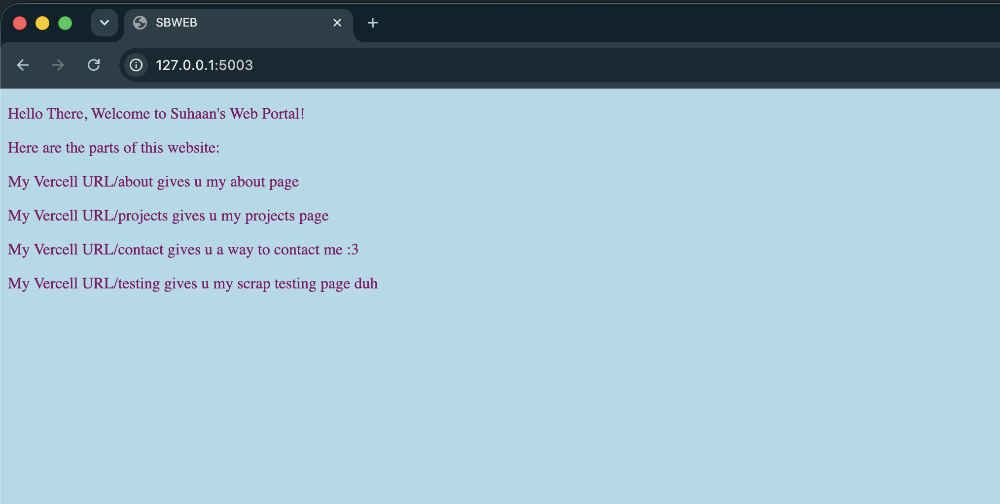
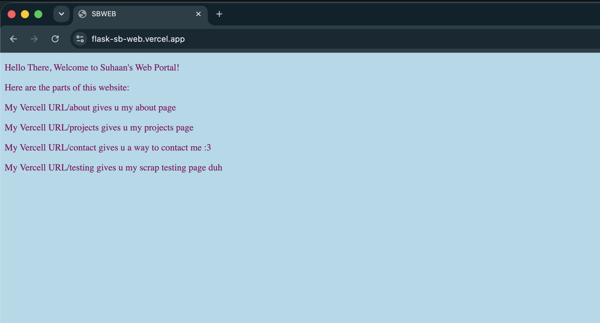
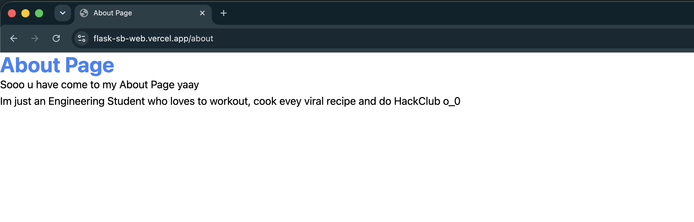
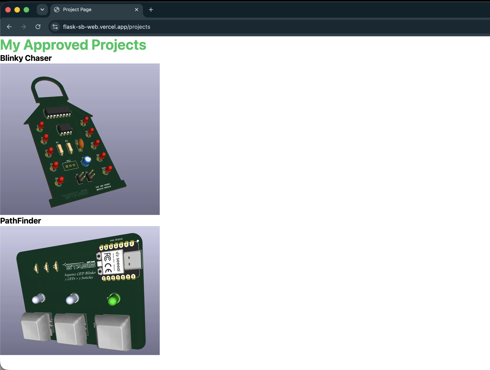
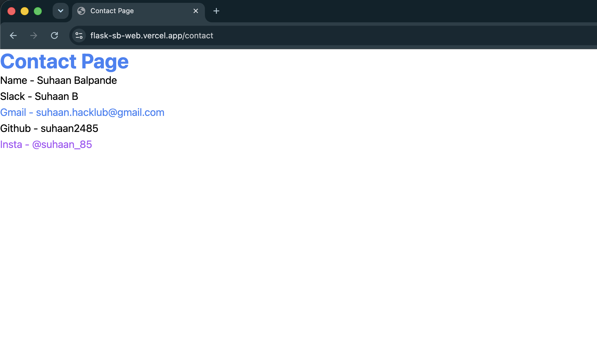
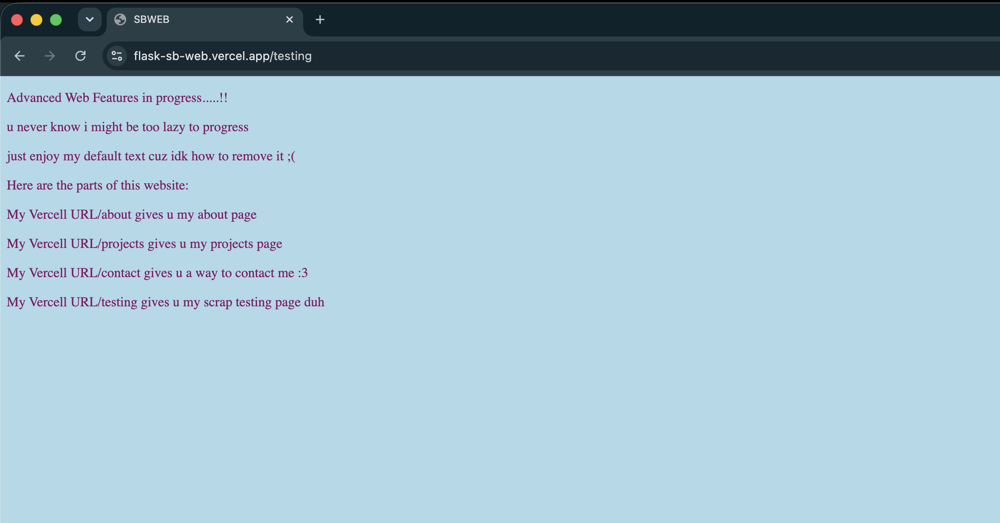

# Flask-SB-Web
Simple Web Interface Made using Flask, guided Horizons Project

Vercel Host URL: https://flask-sb-web.vercel.app/

AI Disclousure: I used ChatGpt and Codex to understand and fix codes as all this was new to me 

Softwares Used: Google Chrome, VS Code, TextEdit(macOS), Codex.

This is just a simple Website i made might be too basic, if i get to know more adv html i would def work more on this.
What This Website is:
This website first welcome you (who does no one but atleast i do!!!) 
Then it shows u how to access the different parts of the website by using /
i dont wanna expain each / as i have done it already 
the /'s include about, projects, contact and testing.

# Photos:

1. Normal(/) 5003 port (http://127.0.0.1:5003/)

2. Normal(/) Vercell (https://flask-sb-web.vercel.app/)

3. /about Vercell (https://flask-sb-web.vercel.app/about)

4. /projects Vercell (https://flask-sb-web.vercel.app/projects)

5. /contact Vercell (https://flask-sb-web.vercel.app/contact)

6. /testing Vercell (https://flask-sb-web.vercel.app/testing)

